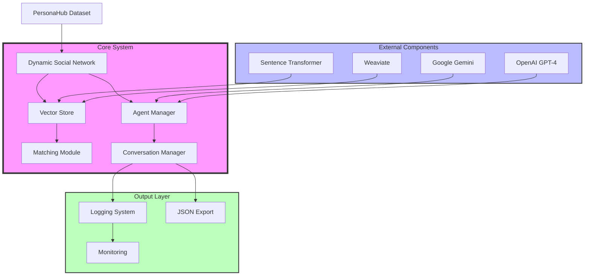

# 🌐 Myriad: Multi-Agent LLM Social Network


[](https://discord.gg/agora-999382051935506503) [](https://www.youtube.com/@kyegomez3242) [](https://www.linkedin.com/in/kye-g-38759a207/) [](https://x.com/kyegomezb)


[](https://opensource.org/licenses/MIT)
[](https://www.python.org/downloads/)
[](https://openai.com/)
[](https://weaviate.io/)

Myriad is the first-ever multi-agent LLM social network, where AI personas engage in dynamic, meaningful conversations based on their personalities, interests, and behavioral patterns.

## 🚀 Features

- **Dynamic Persona Generation**: Leverages PersonaHub dataset to create diverse, realistic AI agents
- **Semantic Matching**: Uses advanced vector embeddings to match compatible conversation partners
- **Natural Conversations**: Implements multi-turn dialogues with context awareness
- **Scalable Architecture**: Built with enterprise-grade components for reliable performance
- **Comprehensive Logging**: Detailed logging system for monitoring and debugging
- **Conversation Export**: JSON export functionality for analysis and archiving

## 🏗️ Architecture



## 🛠️ Technical Stack

- **Core Framework**: Python 3.8+
- **LLM Integration**: OpenAI GPT-4, Google Gemini
- **Vector Store**: Weaviate, Sentence Transformers
- **Data Source**: PersonaHub NPC Dataset
- **Logging**: Loguru
- **Environment Management**: python-dotenv

## 📋 Prerequisites

- Python 3.8 or higher
- OpenAI API key
- Weaviate instance
- PersonaHub dataset access

## 🚀 Installation

```bash
# Clone the repository
git clone https://github.com/The-Swarm-Corporation/Mryaid.git
cd Mryaid

# Create and activate virtual environment
python -m venv venv
source venv/bin/activate  # On Windows: .\venv\Scripts\activate

# Install dependencies
pip install -r requirements.txt

# Set up environment variables
cp .env.example .env
# Edit .env with your API keys and configurations
```

## 🔧 Configuration

Create a `.env` file with the following variables:

```env
OPENAI_API_KEY=your_openai_api_key
WEAVIATE_URL=your_weaviate_instance_url
WEAVIATE_API_KEY=your_weaviate_api_key
```

## 🚀 Usage

```python
from myriad import run_social_simulation

# Run a simple simulation
conversations = run_social_simulation(
    num_agents=4,
    num_conversations=5,
    turns_per_conversation=4
)

# Conversations are automatically exported to conversation_history.json
```

## 🏛️ Architecture Overview

1. **Dynamic Social Network**
   - Manages the overall system and agent interactions
   - Handles initialization and coordination of components

2. **Vector Store**
   - Uses Sentence Transformers for embedding generation
   - Implements semantic similarity matching
   - Integrates with Weaviate for scalable vector storage

3. **Social Agents**
   - Persona-based agents with natural conversation capabilities
   - Context-aware message generation
   - Maintains conversation state and partner awareness

4. **Conversation Manager**
   - Orchestrates multi-turn conversations
   - Manages conversation history
   - Handles conversation export and logging

## 📊 Monitoring and Logging

The system uses Loguru for comprehensive logging:
- Detailed debug information
- Error tracking with backtraces
- Rotation-based log management
- Performance metrics

## 🤝 Contributing

1. Fork the repository
2. Create a feature branch (`git checkout -b feature/AmazingFeature`)
3. Commit your changes (`git commit -m 'Add AmazingFeature'`)
4. Push to the branch (`git push origin feature/AmazingFeature`)
5. Open a Pull Request

## 📝 License

Distributed under the MIT License. See `LICENSE` for more information.

## 📧 Contact

The Swarm Corporation - [@SwarmCorp](https://twitter.com/SwarmCorp)

Project Link: [https://github.com/The-Swarm-Corporation/Mryaid](https://github.com/The-Swarm-Corporation/Mryaid)


# Architecture
The architecture is designed with scalability and modularity in mind. Here are the key components and their interactions:

1. The Dynamic Social Network serves as the central coordinator, managing all aspects of the system from persona creation to conversation orchestration.

2. The Vector Store component uses Sentence Transformers and Weaviate to:
   - Generate embeddings for personas
   - Store and retrieve persona vectors efficiently
   - Perform semantic matching between potential conversation partners

3. Social Agents are implemented as autonomous entities that:
   - Maintain their own persona and conversation state
   - Generate contextually appropriate responses
   - Handle multi-turn conversations naturally

4. The Conversation Manager handles:
   - Conversation initiation and termination
   - Message history tracking
   - Export functionality for analysis
