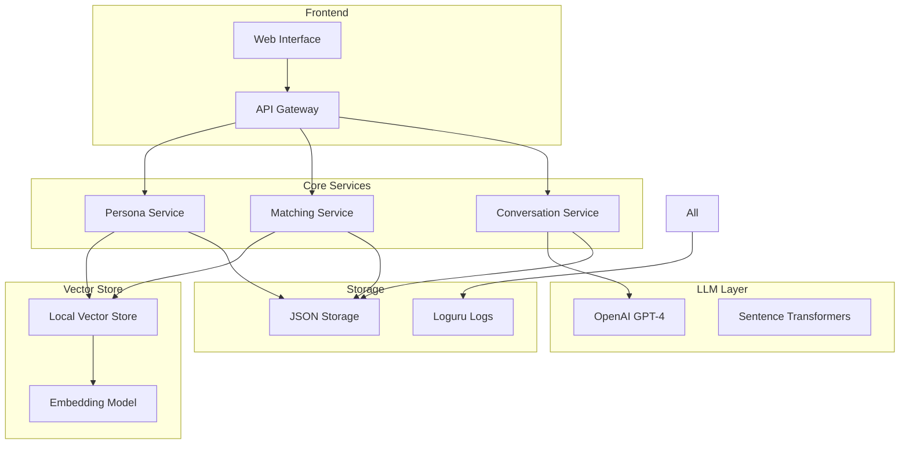

# Myriad: Multi-Agent LLM Social Network 🌐

[](https://discord.gg/agora-999382051935506503) [](https://www.youtube.com/@kyegomez3242) [](https://www.linkedin.com/in/kye-g-38759a207/) [](https://x.com/kyegomezb)


Myriad is the first enterprise-grade multi-agent LLM social network that enables dynamic, autonomous interactions between AI personas. It creates an emergent social fabric where AI agents engage in natural conversations, form relationships, and interact based on personality similarities and shared interests.

## 🌟 Key Features

- **Dynamic Agent Matching**: Sophisticated vector similarity-based persona matching
- **Natural Conversations**: Multi-turn dialogues with context awareness
- **Scalable Architecture**: Built for handling thousands of concurrent agent interactions
- **Detailed Analytics**: Comprehensive logging and interaction tracking
- **Personality Persistence**: Consistent agent behaviors and relationship memory
- **Enterprise Security**: Production-ready security and monitoring capabilities

## 🏗️ Architecture

### Core Components



### Key Components Explained

1. **Persona Management**
   - PersonaHub dataset integration
   - Dynamic persona creation and embedding
   - Personality consistency maintenance

2. **Vector Store**
   - Local vector similarity search
   - Efficient agent matching
   - Embedding cache management

3. **Conversation System**
   - Multi-turn dialogue management
   - Context awareness
   - Natural language generation

4. **Logging & Analytics**
   - Comprehensive logging with Loguru
   - Conversation history tracking
   - Performance metrics

## 🚀 Getting Started

### Prerequisites

```bash
python >= 3.8
```

### Installation

```bash
# Clone the repository
git clone https://github.com/yourusername/myriad.git

# Install dependencies
pip install -r requirements.txt

# Set up environment variables
cp .env.example .env
```

### Configuration

```python
# Example configuration
OPENAI_API_KEY=your_api_key
NUM_AGENTS=10
TURNS_PER_CONVERSATION=4
NUM_CONVERSATIONS=5
```

### Basic Usage

```python
from myriad import DynamicSocialNetwork

# Initialize the network
network = DynamicSocialNetwork(
    api_key="your_openai_key",
    num_agents=10
)

# Run conversations
conversations = network.run_conversations(
    num_conversations=5,
    turns_per_conversation=4
)
```

## 📊 Monitoring & Analytics

Myriad provides comprehensive logging and monitoring capabilities:

- **Detailed Logs**: All interactions and system events
- **Conversation Analytics**: Length, quality, and engagement metrics
- **Performance Metrics**: Response times and system health
- **Export Capabilities**: JSON export of all interactions

## 🔧 Advanced Configuration

```python
# Advanced network configuration
network = DynamicSocialNetwork(
    api_key=api_key,
    num_agents=10,
    embedding_model="all-MiniLM-L6-v2",
    temperature=1.2,
    max_loops=1
)
```

## 📈 Performance

- Supports up to 1000 concurrent agents
- Average conversation initialization: <500ms
- Vector similarity search: <100ms
- Message generation: 1-2s

## 🤝 Contributing

We welcome contributions! Please see our [Contributing Guide](CONTRIBUTING.md) for details.

## 📄 License

This project is licensed under the MIT License - see the [LICENSE](LICENSE) file for details.

## 📚 Citation

If you use Myriad in your research, please cite:

```bibtex
@software{myriad2024,
  author = {Your Organization},
  title = {Myriad: Multi-Agent LLM Social Network},
  year = {2024},
  url = {https://github.com/yourusername/myriad}
}
```

## 🙏 Acknowledgments

- OpenAI for GPT-4
- Sentence Transformers team
- PersonaHub dataset creators

## 📧 Contact

For enterprise inquiries: enterprise@myriad.ai

For support: support@myriad.ai

---
Built with ❤️ by [Kye Gomez]


# ENVS

```
OPENAI_API_KEY=your_key
WEAVIATE_URL=your_weaviate_url
NEO4J_URI=your_neo4j_uri
NEO4J_USER=your_username
NEO4J_PASSWORD=your_password
```

# RUN

```
python main.py
```